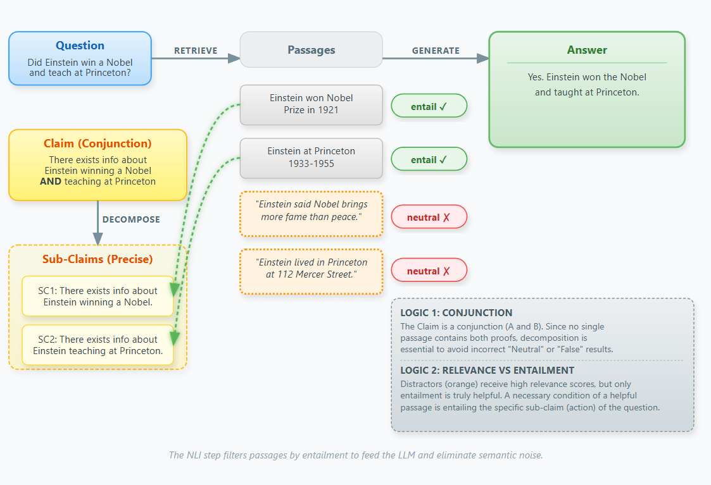

# RAG with NLI and Sub-Claim Decomposition

[](https://www.python.org/)
[](https://www.docker.com/)
[](https://aws.amazon.com/)
[](LICENSE)

[Français](README.fr.md)

My project explores how Natural Language Inference (NLI) and claim decomposition can be integrated into a Retrieval-Augmented Generation (RAG) pipeline to reduce retrieval noise and improve answer grounding.


## Motivation

Standard RAG systems often retrieve passages that are:

- loosely related to the question,
- partially contradictory,
- or irrelevant but semantically similar.

This noise can confuse the generator and degrade answer quality.

This project proposes:

- using NLI-based entailment filtering to keep only passages that logically support a claim,
- and an extension based on sub-claim decomposition for comparative or multi-entity questions.

## Approach Overview

Three pipelines are implemented and compared:

### RAG Baseline

- Dense retrieval (FAISS)
- Prompt-based generation

### RAG + NLI

- Retrieved passages are filtered using an NLI model
- Only passages that entail the claim are kept
- A detailed explanation of the method is available here [RAG + NLI](docs/rag_nli.md).

### RAG + NLI + Sub-Claims

- Complex claims are decomposed into simpler sub-claims
- Each sub-claim is validated independently with NLI
- Passages are kept only if they support at least one sub-claim
- A detailed explanation of the method is available here [RAG + NLI + Sub-Claims](docs/rag_nli_subclaim.md).

This allows finer-grained filtering, especially for comparative or compositional questions.

## System Architecture

The diagram below illustrates the main pipeline (**RAG + NLI + Sub-Claims**). It details how complex queries are decomposed and how the NLI model acts as a semantic gatekeeper to filter out noise before generation.

<p align="center">
  
  <br>
  <em>(Figure: Workflow of Sub-Claim Decomposition and NLI Entailment Filtering)</em>
</p>

## Evaluation

Experiments were conducted on HotpotQA (distractor setting).

**Metrics used:**

- Exact Match
- F1
- BERTScore (Precision / Recall / F1)

  **Key results:**  
With our most advanced pipeline (**RAG + NLI + Sub-Claims**) we observed up to **+16% improvement in Exact Match** and **+10% in F1** compared to a standard RAG baseline, depending on the model and Top-K configuration.

These improvements mainly stem from **retrieval noise reduction**, achieved through NLI-based entailment filtering and sub-claim decomposition, rather than from increasing generator capacity.

Results show consistent improvements over the RAG baseline, with:

- reduced irrelevant or off-topic passages,
- improved answer grounding,
- clearer gains for composition-heavy and comparative questions.

Detailed evaluation results (per model and Top-K) are available in:  
[`docs/evaluations.md`](docs/evaluations.md)


## Analysis Agent (Demonstration)

In addition to quantitative evaluation, the project includes an analysis agent powered by Gemini.

This agent:

- compares answers from RAG vs RAG + NLI Sub-Claims,
- inspects retrieved passages before and after filtering,
- explains why one pipeline produces a more reliable answer.

This component is intended as a pedagogical and interpretability tool, not as part of the core evaluation loop.


## Project Structure

```
rag-nli/
│
├── rag/                 # Retrieval & generation
├── nli/                 # NLI model and filtering logic
├── pipelines/           # RAG / RAG+NLI / RAG+NLI+Subclaim
├── evaluation/          # Metrics and experiments
├── agents/              # Analysis agent
├── api/                 # FastAPI service
├── scripts/             # Experiment runners
├── data/
├── docs/
└── Dockerfile
└── README.md

```

## Running the Project

### 1. Install dependencies

```bash
pip install -r requirements.txt
```

### 2. Run experiments

```bash
python -m scripts.run_experiments
```

This will run all pipelines on a subset of HotpotQA and output evaluation metrics.

### 3. Run the API

The project exposes a FastAPI service for question answering.

```bash
python -m uvicorn api.main:app --host 127.0.0.1 --port 8001
```

## API Key Configuration (Gemini)

Some components (analysis agent) use Gemini 2.5 Flash.

1. Generate an API key here:
   https://aistudio.google.com/app/apikey

2. Create a file named `.env` at the root of the project.

3. Add your key inside the `.env` file:
   ```env
   GOOGLE_API_KEY=your_api_key_here


## Optional: Docker Deployment

The project can also be containerized using Docker for easier deployment and reproducibility.

A Dockerfile is provided to:

- install dependencies,
- expose the FastAPI service,
- run the application in a reproducible environment.

**Example commands:**

```bash
docker build -t rag-nli-app .
docker run -p 8001:8001 rag-nli-app
```

This setup was tested locally and deployed on an AWS EC2 (Ubuntu) instance.

## Limitations

- Sub-claim decomposition is rule-based and heuristic
- Not all claims in HotpotQA are decomposable
- No statistical significance testing (CPU-only setup)
- Focus is on retrieval noise reduction, not full hallucination prevention

These limitations are discussed transparently to emphasize realism and reproducibility.

## Technologies

- Python
- Hugging Face
- FAISS
- FastAPI
- LangChain / LangGraph
- Docker
- AWS
- Gemini (Google GenAI)

## References

[1] Lu Dai, Hao Liu, Hui Xiong. "Improve Dense Passage Retrieval with Entailment Tuning." The Hong Kong University of Science and Technology, 2024.

[2] Ori Yoran, et al. "Making Retrieval-Augmented Language Models Robust to Irrelevant Context." ICLR, 2024. (Foundational work on noise filtration in RAG).

[3] Akari Asai, et al. "Self-RAG: Learning to Retrieve, Generate, and Critique through Self-Reflection." ICLR, 2024. (Context regarding self-correction and claim support).

[4] Shahul Es, et al. "RAGAS: Automated Evaluation of Retrieval Augmented Generation." EACL, 2024. (Framework used for defining Faithfulness metrics via NLI).

[5] Nelson F. Liu, et al. "Lost in the Middle: How Language Models Use Long Contexts." TACL, 2024. (Highlights the necessity of filtering to avoid performance degradation in long contexts).
