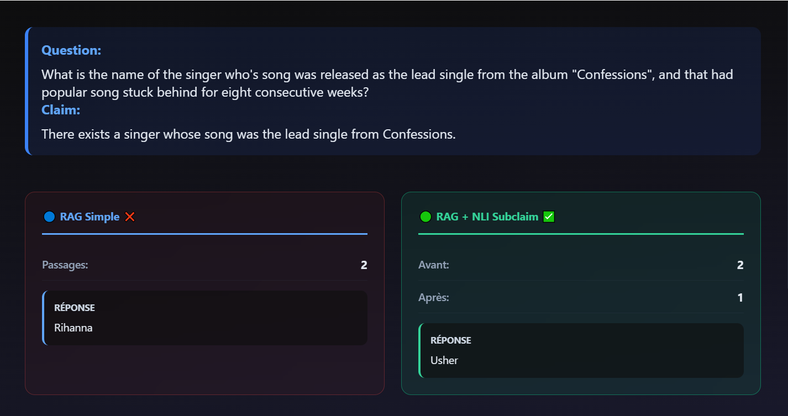
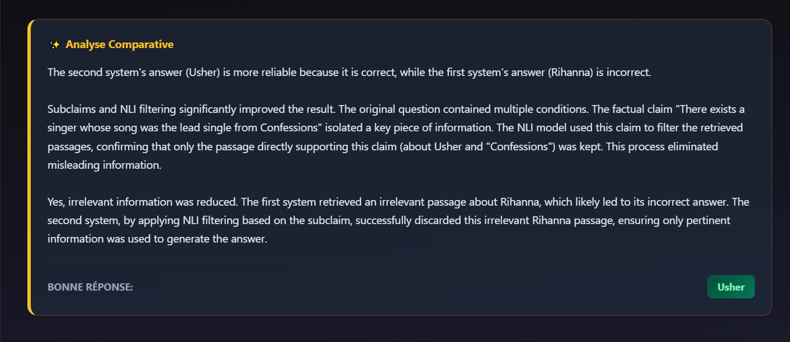

# Smart RAG Pipeline - Improving Answer Accuracy Through Intelligent Filtering

[](https://www.python.org/)
[](https://www.docker.com/)
[](https://aws.amazon.com/)
[](LICENSE)

[Français](README.fr.md)

Production-ready Retrieval-Augmented Generation system that filters out irrelevant information before answer generation, delivering more accurate and trustworthy AI responses.

**Perfect for:** Customer support, legal document analysis, technical documentation search, compliance verification

---

## Why This Matters

Standard chatbots and Q&A systems often suffer from critical issues:

- ❌ **Hallucinations** - Give confident but incorrect answers
- ❌ **Information noise** - Mix relevant and irrelevant content
- ❌ **Complex question failures** - Struggle with multi-part questions

**This system solves these problems by:**

- ✅ Filtering out noise before generating answers (demonstrated improvements in accuracy)
- ✅ Validating each piece of information independently
- ✅ Handling complex questions requiring multiple sources

**Real-world impact:**
- Reduced customer support errors and response time
- Faster document review for legal and compliance teams
- More reliable knowledge base search
- Lower operational costs from fewer incorrect answers

---

## How It Works

### Simple Overview

The system uses a three-stage intelligent filtering approach:

1. **Retrieve** - Search for potentially relevant documents using dense vector search (FAISS)
2. **Verify** - AI validates each document: *"Does this information actually support answering the question?"*
3. **Filter** - Keep only verified, relevant information
4. **Generate** - Create answer from clean, validated data only

### Three Pipeline Variants

| Pipeline | Description | Best For |
|----------|-------------|----------|
| **RAG Baseline** | Standard retrieval + generation | Simple factual questions |
| **RAG + NLI** | Adds intelligent filtering using Natural Language Inference | General Q&A with noise reduction |
| **RAG + NLI + Sub-Claims** | Decomposes complex questions into simpler parts | Multi-part, comparative questions |

### Advanced Architecture

<p align="center">
  
  <br>
  <em>Workflow of Sub-Claim Decomposition and NLI Entailment Filtering</em>
</p>

📖 **Technical deep-dives:**
- [RAG + NLI detailed explanation](docs/rag_nli.md)
- [RAG + NLI + Sub-Claims detailed explanation](docs/rag_nli_subclaim.md)

---

## Quick Demo

**Problem:** Standard RAG systems hallucinate when documents contain misleading information.

**Question:** *"What album did Usher release that went diamond?"*

| System | Answer | Status |
|--------|--------|--------|
| **Baseline RAG** | "Rihanna's album..." | ❌ Wrong (confused by noise) |
| **RAG + NLI + Sub-Claims** | "Confessions" | ✅ Correct (filtered noise) |

**How?** The system detected that the Rihanna document didn't actually answer the question about Usher, filtered it out, and used only verified information.

---

## Performance Metrics

**Evaluation on industry-standard HotpotQA benchmark:**

| Metric | Improvement vs Baseline |
|--------|-------------------------|
| **Answer Accuracy (Exact Match)** | **+16%** |
| **Answer Quality (F1 Score)** | **+10%** |

These improvements stem from **intelligent retrieval noise reduction**, not just throwing more compute at the problem.

📈 [View detailed evaluation results](docs/evaluations.md)

---

## Quick Start

### 1. Install dependencies

```bash
pip install -r requirements.txt
```

### 2. Run experiments

```bash
python -m scripts.run_experiments
```

This will run all pipelines on a subset of HotpotQA and output evaluation metrics.

### 3. Run the API

The project exposes a FastAPI service for question answering.

```bash
python -m uvicorn api.main:app --host 127.0.0.1 --port 8001
```

## API Key Configuration (Gemini)

Some components (analysis agent) use Gemini 2.5 Flash.

1. Generate an API key here:
   [https://aistudio.google.com/app/apikey](https://aistudio.google.com/app/apikey)

2. Create a file named `.env` at the root of the project.

3. Add your key inside the `.env` file:
   ```env
   GOOGLE_API_KEY=your_api_key_here
   ```

---

## Real-World Applications

### Customer Support
**Problem:** Agents give inconsistent answers from noisy knowledge bases  
**Solution:** Filter irrelevant articles → faster, more accurate responses  
**Impact:** Reduced ticket resolution time, improved CSAT scores

### Legal & Compliance
**Problem:** Document review requires validating claims against multiple sources  
**Solution:** Multi-source validation with entailment checking  
**Impact:** Reduced liability risk, faster contract analysis

### Technical Documentation
**Problem:** Complex "how-to" questions need information from multiple docs  
**Solution:** Sub-claim decomposition handles multi-step questions  
**Impact:** Better developer experience, reduced support load

### Healthcare Information
**Problem:** Medical guidance requires high accuracy and source verification  
**Solution:** Independent validation of each information piece  
**Impact:** Safer, more trustworthy medical information delivery

---


## Analysis Agent

Built-in debugging agent powered by Gemini that explains pipeline decisions in plain language.

**Example Analysis:**

**1. Comparing Results:**

<p align="center">
  
</p>

The agent shows how the baseline fails (hallucination) while the filtered system succeeds.

**2. Understanding Why:**

<p align="center">
  
</p>

The agent explains the NLI module successfully filtered out the "distractor" passage about Rihanna because it didn't entail the claim about Usher's album "Confessions".

*This agent helps during development to analyze pipeline decisions, compare baseline vs filtered outputs, and provides actionable insights for system tuning.*

---

## Docker Deployment

Production-ready containerized deployment:

```bash
# Build the Docker image
docker build -t rag-nli-app .

# Run the container
docker run -p 8001:8001 rag-nli-app

# Access the API
curl http://localhost:8001/health
```

**Deployment tested on:**
- Local development (Linux/macOS/Windows)
- AWS EC2 (Ubuntu)
- Cloud container services (ECS, Cloud Run compatible)

---

## Project Structure

```
rag-nli/
│
├── rag/                 # Retrieval & generation modules
├── nli/                 # NLI model and filtering logic
├── pipelines/           # Pipeline implementations
│   ├── baseline.py      # Standard RAG
│   ├── nli.py          # RAG + NLI filtering
│   └── subclaim.py     # RAG + NLI + Sub-claims
├── evaluation/          # Metrics and experiment runners
├── agents/              # Analysis agent for debugging
├── api/                 # FastAPI service
├── scripts/             # Experiment execution scripts
├── data/               # Dataset storage
├── docs/               # Detailed documentation
├── Dockerfile          # Container configuration
└── README.md
```

---

## Built With

**Core Technologies:**
- **Python 3.10+** - Main programming language
- **FastAPI** - Production API framework
- **Docker** - Containerization

**AI/ML Stack:**
- **Hugging Face Transformers** - NLI models and text generation
- **FAISS** - Fast vector similarity search
- **LangChain / LangGraph** - Pipeline orchestration

**Deployment:**
- **AWS EC2** - Cloud deployment tested
- **Google Gemini** - Analysis agent

---

## Current Limitations & Roadmap

**Current limitations:**
- Sub-claim decomposition uses rule-based heuristics (can be improved with learned decomposition)
- Not all question types in HotpotQA benefit equally from decomposition
- Evaluation conducted on CPU only (no statistical significance testing yet)
- Proof-of-concept evaluation scale (demonstrates methodology on benchmark subset)
- Focus on retrieval noise reduction, not full hallucination prevention

**Future improvements:**
- Learned sub-claim generation using LLMs
- GPU-accelerated evaluation for statistical testing
- Expanded dataset coverage beyond HotpotQA
- Fine-tuned NLI models for domain-specific use cases

These limitations are acknowledged to emphasize realism and guide future development.

---

## Research Background

This project builds on recent advances in RAG system reliability:

**Key inspirations:**

[1] Lu Dai, Hao Liu, Hui Xiong. *"Improve Dense Passage Retrieval with Entailment Tuning."* HKUST, 2024.

[2] Ori Yoran, et al. *"Making Retrieval-Augmented Language Models Robust to Irrelevant Context."* ICLR, 2024.

[3] Akari Asai, et al. *"Self-RAG: Learning to Retrieve, Generate, and Critique through Self-Reflection."* ICLR, 2024.

[4] Shahul Es, et al. *"RAGAS: Automated Evaluation of Retrieval Augmented Generation."* EACL, 2024.

[5] Nelson F. Liu, et al. *"Lost in the Middle: How Language Models Use Long Contexts."* TACL, 2024.

---
